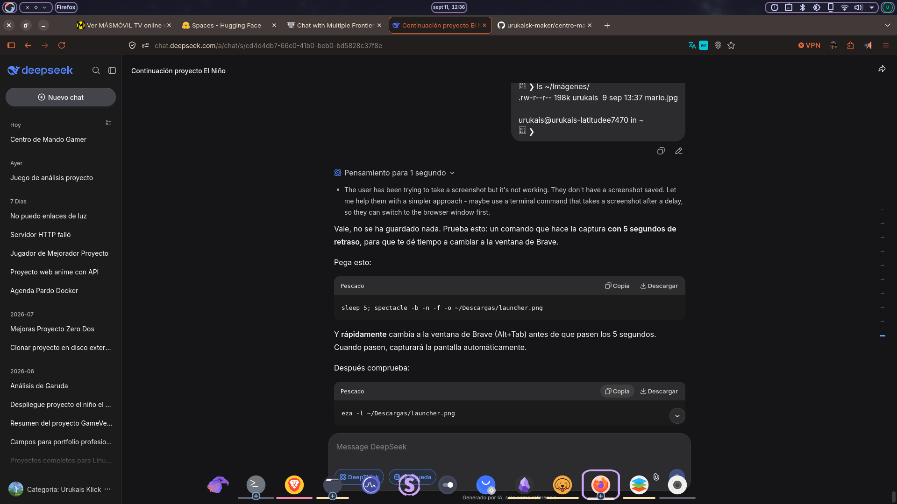

# 🎮 Centro de Mando Gamer – Plataforma "El Niño"



> Regalo para **Mario** · ...

---

## ¿Qué es esto?

Una unidad de almacenamiento portátil de **224 GB** que funciona como centro de
entretenimiento autónomo. Se conecta a cualquier PC (Linux o Windows), se arranca
un servidor local y, con un solo clic, tienes acceso a emulación retro, juegos
completos gratuitos, herramientas de streaming, mods y un diario personal.

**No requiere instalación. No deja rastro en el ordenador anfitrión. Es plug and play.**

---

## 🚀 Cómo se usa

### En Linux

```bash
bash Iniciar.sh
```

Se abre el navegador solo en `http://localhost:8080/01_EL_NINO_LAUNCHER/index.html`.

### En Windows

```
Iniciar.bat
```

### Para detenerlo

```bash
bash Detener.sh
```

---

## 📁 Estructura del disco

```
DISCO PORTÁTIL (224 GB)
├── 01_EL_NINO_LAUNCHER/       → Dashboard web (index.html, CSS, JS)
├── 02_EMULADORES_Y_ROMS/      → Emuladores portables y ROMs
│   ├── 01_PS2/                → PlayStation 2
│   ├── 02_PSP/                → PlayStation Portable
│   ├── 03_GAMECUBE_WII/       → GameCube y Wii
│   ├── 04_GBA_SNES/           → Game Boy Advance y SNES
│   ├── 05_ARCADE_MAME/        → Arcade
│   ├── EJECUTABLES_PORTABLES/ → AppImages y scripts de arranque
│   └── SAVES_GUARDADOS/       → Partidas guardadas
├── 03_STREAMING_Y_CLIPS/      → OBS, overlays y clips
├── 04_MODS_Y_SHADERS/         → Mods y shaders
├── 05_HERRAMIENTAS_GAMER/     → Utilidades para jugadores
├── 06_MEDIA_Y_WALLPAPERS/     → Fondos, iconos y temas
├── 07_DIARIO_MARIO/           → Diario personal en HTML
├── 08_JUEGOS_EXTRA/           → Juegos completos gratuitos
├── server.py                  → Servidor Python (lanza emuladores y juegos)
├── Iniciar.sh / Iniciar.bat   → Arranque del sistema
├── Detener.sh                 → Detiene el servidor
└── README.md                  → Este archivo
```

---

## 🎮 Juegos incluidos (funcionando ahora mismo)

| Juego | Género | Motor |
|-------|--------|-------|
| **Cave Story** | Plataformas indie | NXEngine (RetroArch) |
| **Freedoom** | FPS (2 campañas) | PrBoom (RetroArch) |
| **Quake** | FPS clásico | TyrQuake (RetroArch) |
| **OpenRA (Red Alert)** | Estrategia en tiempo real | Nativo (AppImage) |
| **2048** | Puzzle | HTML en navegador |

---

## 🕹️ Emuladores preparados

| Sistema | Emulador | Estado |
|---------|----------|--------|
| PlayStation 2 | PCSX2 | Necesita BIOS y ROMs propias |
| PlayStation Portable | PPSSPP | Necesita ROMs propias |
| GameCube / Wii | Dolphin | Necesita BIOS y ROMs propias |
| GBA / SNES | mGBA | Necesita ROMs propias |
| Multi-sistema | RetroArch | Núcleos instalados (FCEUmm, Snes9x, mGBA, PrBoom, TyrQuake, NXEngine) |

**Nota legal:** los emuladores son software libre. Las ROMs e ISOs de juegos
comerciales solo se pueden usar si Mario posee los discos originales de sus consolas.

---

## 🛠️ Cómo añadir más juegos

### Emuladores (PS2, PSP, GC/Wii, GBA, SNES)

1. Copia las ROMs o ISOs en la carpeta correspondiente dentro de `02_EMULADORES_Y_ROMS/`.
2. Para PS2 y GameCube/Wii, coloca las BIOS en sus subcarpetas `BIOS/`.
3. Abre el launcher y pulsa el botón del emulador.

### Juegos extra (formato RetroArch)

1. Mete el archivo en `08_JUEGOS_EXTRA/`.
2. Crea un script `.sh` en la misma carpeta que lance RetroArch con el core adecuado.
3. Añade una tarjeta en el `index.html`.

---

## 🔧 Tecnologías usadas

- **Servidor:** Python 3 (`http.server` + `subprocess`)
- **Frontend:** HTML, CSS y JavaScript vanilla
- **Scripts:** Bash (Linux), Batch (Windows), Fish (desarrollo)
- **Emuladores:** PCSX2, PPSSPP, Dolphin, mGBA, RetroArch (AppImages portables)
- **Sistema de desarrollo:** Garuda Linux (Arch-based) con fish

---

## 👨‍💻 Sobre el creador

**Manuel Casimiro Carrasco** — Diseñador y desarrollador.

- 🔗 GitHub: [urukaisk-maker](https://github.com/urukaisk-maker)
- 🔗 Portfolio: [unique-biscochitos-31bcea.netlify.app](https://unique-biscochitos-31bcea.netlify.app/)
- 🔗 Urukais Klick: [thriving-otter-cc1e25.netlify.app](https://thriving-otter-cc1e25.netlify.app/)

---

## 💚 Agradecimiento especial

**A Mario.** Por ser motivo de este proyecto. Espero que lo disfrutes tanto como
yo he disfrutado construyéndolo. Cada carpeta, cada script, cada línea del launcher
está pensada para que abras el disco, hagas un clic, y te pongas a jugar.

Disfrútalo. Y cuando quieras añadir algo nuevo, aquí tienes todo lo necesario.

— Manuel, desde Reus

---

*Centro de Mando Gamer "El Niño" · 2026*
