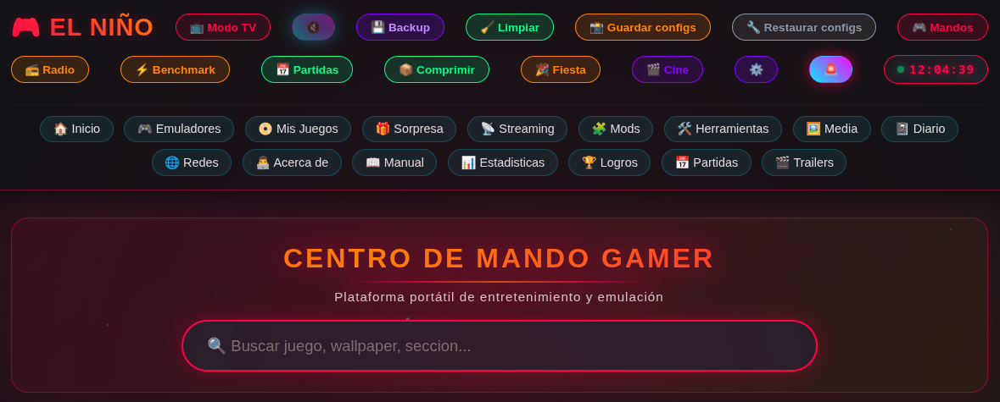
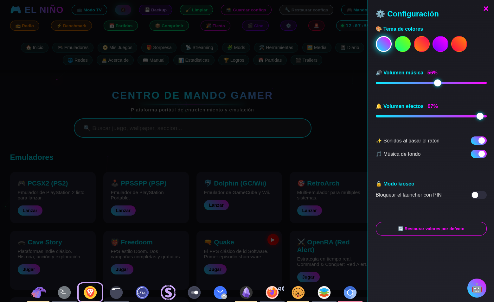
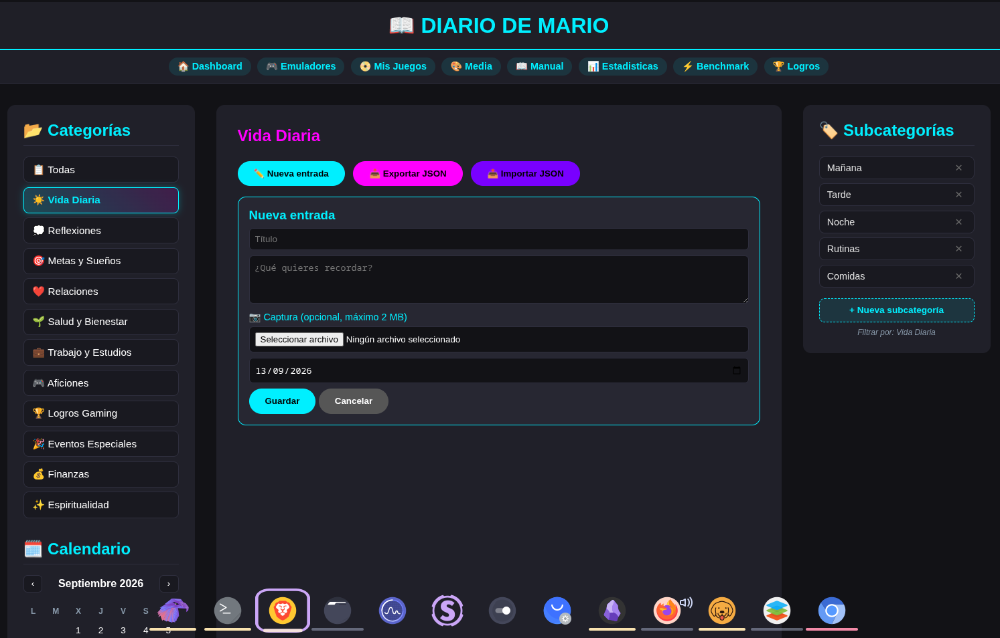

# Centro de Mando Gamer - Plataforma "El Nino"

[](https://centro-mando-gamer-el-nino-mmcq.vercel.app/)
[](https://urukaisk-maker.github.io/centro-mando-gamer-el-nino/)
[](https://opensource.org/licenses/MIT)
[](https://www.python.org/)


<sub>Demo del launcher: particulas, glow y modo alerta</sub>

## Galeria

<div align="center">

### Launcher principal


### Modo Alerta


### Panel de configuracion


### Diario personal con subcategorias


</div>

> Demo Vercel: https://centro-mando-gamer-el-nino-mmcq.vercel.app/
> Demo Pages: https://urukaisk-maker.github.io/centro-mando-gamer-el-nino/

> Regalo para **Mario** - Disenado por **Manuel Casimiro Carrasco**
> Desde Reus, Tarragona - 2026

---

## Que es esto?

Una unidad de almacenamiento portatil de 224 GB que funciona como centro de entretenimiento autonomo. Se conecta a cualquier PC (Linux o Windows), arranca un servidor local y con un clic tienes acceso a emulacion retro, juegos completos gratuitos, herramientas de streaming, mods y un diario personal.

**No requiere instalacion. No deja rastro. Es plug and play.**

---

## Arquitectura

```
Launcher Web (HTML/CSS/JS)  <--HTTP/SSE-->  Servidor Python (ThreadingTCPServer)
         |                                          |
         v                                          v
     Navegador                            Scripts Bash/Batch
                                                    |
                                                    v
                                    Emuladores / Juegos / AppImages
```

Diagrama detallado en ARCHITECTURE.md.

---

## Como se usa

### En Linux

Doble clic en "Abrir El Nino.desktop" desde la carpeta del disco, o:

```bash
bash Iniciar.sh
```

### En Windows

Doble clic en "ABRIR EL NINO.bat" desde la carpeta del disco.

### Para detenerlo

```bash
bash Detener.sh
```

---

## Caracteristicas

### Launcher web (17 tarjetas)

- **4 emuladores:** PCSX2, PPSSPP, Dolphin, RetroArch
- **13 juegos completos:** Cave Story, Freedoom, Quake, OpenRA, 0 A.D., Xonotic, Luanti, Battle for Wesnoth, OpenTTD, Endless Sky, SuperTux, Widelands, Shattered Pixel Dungeon

### Interfaz Cyberpunk

- Variables CSS centralizadas (cambiar paleta con 1 linea)
- Particulas de neon flotando
- Glow dinamico que sigue al raton
- **Modo Alerta** (rojo/ambar pulsante)
- **Modo TV / Big Picture** (tecla T)
- **Header ocultable** al scroll
- **Secuencia de arranque** tipo HUD
- **Reloj digital** en vivo
- **Barra HUD** inferior (Sistema, Modo, Red, CPU, RAM, Sesion)
- Responsive (movil/tablet/desktop)

### Navegacion con mando

- Deteccion automatica de mandos (Xbox, DualShock 4, 8BitDo)
- Navegacion por tarjetas con stick/cruceta
- Perfiles preconfigurados instalables con un clic

### Mando tactil movil

- Abre mobile.html desde el movil (misma WiFi)
- D-Pad, botones A/B/X/Y, L1/R1, SELECT/START/ESC
- Envia pulsaciones al PC via xdotool

### Panel de configuracion

- **5 temas de colores** (cian, verde, naranja, morado, rojo)
- Control de volumen de musica y efectos
- Toggles de sonidos y musica
- **Modo kiosco** con PIN de 4 digitos

### Herramientas integradas

| Boton | Funcion |
|-------|---------|
| Backup | Copia todas las partidas de los emuladores |
| Limpiar | Borra cache, logs y backups antiguos (deja 5) |
| Guardar configs | Snapshot de configs de emuladores |
| Restaurar configs | Restaura el ultimo snapshot |
| Mandos | Instala perfiles de mando |
| Radio | 4 emisoras (J-Pop, K-Pop, Gensokyo, Fallback) |
| Benchmark | Analiza PC y recomienda config por emulador |
| Comprimir | Convierte ISOs a .chd (40-60% menos espacio) |
| Fiesta | Cierra apps, sube volumen, abre RetroArch |
| Cine | Cierra apps, abre Kodi/Stremio/VLC |

### Monitorizacion en tiempo real

- **Server-Sent Events (SSE):** panel de CPU/RAM en vivo
- **Panel de procesos activos:** boton para matar procesos colgados
- **Pagina de estadisticas:** graficos SVG de uso, tiempo, juegos lanzados

### Diario personal

- 12 categorias (incluida Logros Gaming)
- Adjuntar capturas de pantalla
- **Exportar / Importar JSON** para backup
- Calendario y filtros

### RetroAchievements

- Integracion con la API publica
- Muestra puntos, logros y juegos recientes
- Requiere cuenta de retroachievements.org

### Galeria de wallpapers

- 12 fondos a resolucion completa
- Galeria HTML con descarga individual

---

## Matriz de compatibilidad

| Modulo | Linux | Windows | Estado |
|--------|:-----:|:-------:|:------:|
| Launcher web | OK | OK | Completo |
| Servidor Python | OK | OK | Completo |
| PCSX2 (PS2) | OK | Parcial | Necesita BIOS |
| PPSSPP (PSP) | OK | Parcial | Necesita ROMs |
| Dolphin (GC/Wii) | OK | Parcial | Necesita BIOS |
| RetroArch | OK | OK | Completo |
| Juegos PC portables | OK | Parcial | AppImages solo Linux |
| Backup automatico | OK | No | Solo systemd |
| Monitor SSE | OK | OK | Completo |
| Mando tactil movil | OK | OK | Requiere WiFi comun |
| Modo kiosco PIN | OK | OK | Completo |

---

## Estructura del disco

```
DISCO PORTATIL (224 GB)
01_EL_NINO_LAUNCHER/       Launcher, manual, estadisticas, benchmark
02_EMULADORES_Y_ROMS/      Emuladores y ROMs
  01_PS2/ 02_PSP/ 03_GAMECUBE_WII/ 04_GBA_SNES/ 05_ARCADE_MAME/
  EJECUTABLES_PORTABLES/   AppImages y scripts
  SAVES_GUARDADOS/         Backups de partidas y configs
03_STREAMING_Y_CLIPS/      OBS + recursos
04_MODS_Y_SHADERS/         Mods y shaders
05_HERRAMIENTAS_GAMER/     Utilidades + perfiles de mando
06_MEDIA_Y_WALLPAPERS/     12 wallpapers + galeria
07_DIARIO_MARIO/           Diario personal
08_JUEGOS_EXTRA/           13 juegos completos
config.json                Configuracion del servidor
server.py                  Servidor Python
escanear_roms.py           Escaner de ROMs
benchmark.py               Analisis de hardware
Backup_Partidas.sh / Restaurar_Partidas.sh
guardar_configs.sh / restaurar_configs.sh
limpiar_cache.sh / comprimir_roms.sh
modo_fiesta.sh / modo_cine.sh
Iniciar.sh / Detener.sh / ABRIR EL NINO.bat
MANUAL.txt / README.md / LICENSE
DOCUMENTO_TECNICO.md / ARCHITECTURE.md / CONTRIBUTING.md
python_portable/           Python portable para Windows
```

---

## Documentacion

- **README.md** - Este archivo. Vision general.
- **MANUAL.txt** - Manual de uso paso a paso para Mario.
- **DOCUMENTO_TECNICO.md** - Arquitectura tecnica completa.
- **ARCHITECTURE.md** - Diagrama y flujos.
- **CONTRIBUTING.md** - Guia para desarrolladores.
- **PROPUESTAS_MEJORAS.md** - Roadmap futuro.
- **config.json** - Configuracion del servidor.

El manual tambien esta disponible como **libro interactivo** dentro del launcher (17 paginas con indice y navegacion).

---

## Tecnologias

- **Backend:** Python 3 (solo stdlib: http.server, socketserver, subprocess, threading)
- **Frontend:** HTML5, CSS3 (variables + Grid + Flexbox), JavaScript vanilla
- **Comunicacion:** HTTP + Server-Sent Events (SSE)
- **Sistema:** systemd (servicios de usuario)
- **Scripts:** Bash (Linux), Batch (Windows), Fish (desarrollo)
- **Emuladores:** PCSX2, PPSSPP, Dolphin, RetroArch (AppImages)

---

## Compatibilidad

- **Linux:** Garuda, Arch, Debian, Ubuntu, Fedora
- **Windows:** 10, 11 (con Python portable incluido)
- **Hardware:** cualquier PC con 4 GB RAM y GPU integrada
- **Procesador:** x86_64

---

## Licencia

Este proyecto esta bajo licencia **MIT**. Ver LICENSE para mas detalles.

Los juegos incluidos tienen sus propias licencias (GPL, MIT, etc.).
Los emuladores tambien tienen licencias propias.

---

## Agradecimiento especial

**A Mario.** Por ser motivo de este proyecto. Espero que lo disfrutes tanto como yo he disfrutado construyendolo. Cada carpeta, cada script, cada linea del launcher esta pensada para que abras el disco, hagas un clic, y te pongas a jugar.

Disfrutalo. Y cuando quieras anadir algo nuevo, aqui tienes todo lo necesario.

- Manuel, desde Reus

---

## Sobre el creador

**Manuel Casimiro Carrasco** - Disenador y desarrollador.

- GitHub: https://github.com/urukaisk-maker
- Portfolio: https://unique-biscochitos-31bcea.netlify.app/
- Urukais Klick: https://thriving-otter-cc1e25.netlify.app/
- Email: urukaisk@gmail.com

---

*Centro de Mando Gamer "El Nino" - 2026 - Hecho con carino en Reus*
